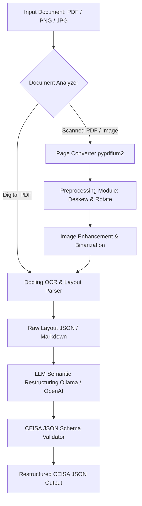

# Architecture & Implementation Plan: CEISA Document OCR & Restructuring Pipeline

This plan outlines the architecture and execution steps for building a Proof of Concept (POC) to ingest, preprocess, scan, and restucture dense customs documents—specifically for the **CEISA (Customs and Excise Information System and Automation)** system, such as PIB (Pemberitahuan Impor Barang) and PEB (Pemberitahuan Ekspor Barang).

---

## 1. High-Level Architecture Design

A major challenge with CEISA documents is that they are highly dense, containing multi-column tables, structured headers, and nested fields. Furthermore, scans are frequently rotated, tilted (skewed), or warped.

The pipeline is split into four distinct layers:

### Layer Breakdown

1. **Ingestion & Analysis Layer**:
   - Accepts PDF files or raw image formats (PNG, JPG).
   - Detects whether a PDF is a native digital document (clean text) or a scan.
   - If it is a native PDF, it bypasses image preprocessing to maintain perfect digital fidelity.
   - If it is a scanned PDF, it renders individual pages to high-resolution images using `pypdfium2` for preprocessing.

2. **Preprocessing Layer (Deskew, Rotate, Unwarp)**:
   - **Rotation Correction**: Corrects landscape/sideways/upside-down pages to an upright (portrait) orientation. This will be implemented using:
     - OpenCV text-direction heuristics (detecting horizontal vs. vertical projection variance).
     - Or falling back to PaddleOCR's built-in orientation classifier (`PaddleOCRVL(use_doc_orientation_classify=True)`), which is highly accurate on diverse scans.
   - **Deskewing (Tilt Correction)**: Detects fine-grain tilt angles (e.g., -15 to +15 degrees) using OpenCV's Hough Line Transform or Minimum Area Bounding Boxes on text contours. The image is rotated by the inverse angle to align all text lines horizontally.
   - **Document Unwarping & Denoising**: Smooths out folds and perspective distortion using perspective warping, and applies adaptive binarization (Otsu thresholding) to remove shadows and enhance low-contrast scanned text.

3. **High-Fidelity Layout OCR Layer (Docling)**:
   - Feed clean, upright, straight documents to **Docling**.
   - Docling excels at structural layout understanding, identifying blocks (headers, paragraphs, lists) and reconstructing complex tables into Markdown/JSON.
   - For scanned images, Docling runs its deep-learning-based OCR to pull high-precision text without scrambling vertical columns.

4. **Semantic Restructuring Layer (LLM Extraction)**:
   - Receives the raw Markdown/JSON from Docling.
   - Uses an LLM (local Ollama or OpenAI GPT-4o) with a highly specific system prompt defining CEISA PIB/PEB fields.
   - Enforces a precise JSON Schema mapping standard customs fields:
     - Importer & Exporter Details (NPWP, Name, Address)
     - Customs Details (Office, Document Type, Registration Details)
     - Financials (FOB Value, Freight, Insurance, NDR, Currency)
     - Nested Line Items (HS Code, Item Description, Quantity, Value, Levies/Taxes)

---

## User Review Required

> [!IMPORTANT]
> **Key Architectural Decisions & Requirements:**
> 1. **Local vs. Cloud LLM**: Local LLMs (via Ollama) can run completely offline, but dense tables with multi-page customs forms often require highly capable reasoning models (like `qwen2.5:14b` or `qwen2.5:32b` locally, or `gpt-4o-mini` / `gpt-4o` via API) to extract every single table line item perfectly. We will support both Ollama and OpenAI API so you can choose.
> 2. **PaddleOCR vs. OpenCV**: We will provide a native OpenCV deskew/rotate utility that runs rapidly on CPU, and integrate PaddleOCR's orientation classifier as a fallback for severe camera-perspective or page warping.
> 3. **Input Format Resolution**: Converting scanned PDFs to 300 DPI images (`scale=3` or `scale=4` in `pypdfium2`) is recommended to ensure high OCR accuracy for small print on forms.

---

## Open Questions

> [!NOTE]
> Please provide feedback on these points, or we can proceed with the standard implementation:
> 1. **Do you have a specific target JSON structure?** Currently, we will define a standard Indonesian customs PIB/PEB JSON structure based on typical forms. If you have a specific database or API schema, we can map to it directly.
> 2. **Is GPU acceleration available?** PaddleOCR's document unwarping is fast on GPU, but we will write our preprocessing scripts to run cleanly on CPU as well.

---

## Proposed Changes

We will organize the code cleanly by introducing a preprocessing module, correcting syntax issues, and integrating the complete pipeline in the main entry point.

### Preprocessing & Helper Components

#### [NEW] [preprocessing.py](file:///home/mendoan/Codes/Projects/OCR/src/module/preprocessing.py)
This module will handle:
- PDF page conversion to PIL images using `pypdfium2`.
- OpenCV-based tilt angle detection and deskewing.
- Orientation correction (detecting 90/180/270 degree rotation and rotating upright).
- Image enhancement (contrast adjustment, adaptive thresholding).

#### [MODIFY] [docling_module.py](file:///home/mendoan/Codes/Projects/OCR/src/module/docling_module.py)
- Remove the syntax error on line 5 (`inputs = InputFormat`).
- Refactor the code to dynamically load the document converter and support both image/PDF formats.
- Add support for converting preprocessed page image lists back into a single clean PDF for Docling, or sending preprocessed images directly.

#### [MODIFY] [ollama_module.py](file:///home/mendoan/Codes/Projects/OCR/src/module/ollama_module.py)
- Create a tailored Indonesian Customs (CEISA PIB) JSON Schema.
- Enhance the prompt to guide the LLM to carefully process multi-item tables, HS Codes, and duties.
- Add error handling for JSON validation.

#### [NEW] [openai_module.py](file:///home/mendoan/Codes/Projects/OCR/src/module/openai_module.py)
- Provide a robust cloud-based fallback module utilizing the official `openai` SDK to handle dense, complex multi-page documents when local Ollama models struggle with multi-page table coherence.

#### [MODIFY] [main.py](file:///home/mendoan/Codes/Projects/OCR/src/main.py)
- Tie the entire pipeline together:
  1. Ingest document and detect format.
  2. If scanned, execute `preprocessing.py` to deskew, rotate, and enhance each page.
  3. Run Docling on the cleaned pages to get raw structured markdown/JSON.
  4. Run Ollama or OpenAI to restructure the markdown into the CEISA-compliant JSON structure.
  5. Save all intermediary results (preprocessed images, raw markdown, and structured JSON) in the `output/` folder for auditing and debugging.

---

## Verification Plan

We will verify each step of the pipeline using the files in the `dataset` directory:

### Automated/Local Tests
- **Preprocessing Validation**: Run the deskew and rotate script on rotated/skewed image files (e.g., `dataset/2.jpg`, `3.jpg`) and verify that the preprocessed outputs saved in `output/` are perfectly upright and aligned.
- **OCR Quality Evaluation**: Verify that `Docling` output on the preprocessed images preserves structural tables and text far better than on the raw, skewed inputs.
- **LLM Structuring Test**: Run the restructured extraction on `ilide.info-draft-pib-pr_24011a9eb9424f0410a915e7e917a653.pdf` (a draft PIB document) and verify that the output JSON perfectly extracts nested customs headers and line items.

### Manual Verification
- Visual inspection of preprocessed images in `output/` to confirm that skew correction and rotation align with text lines.
- JSON structure inspection against standard PIB layout to ensure zero loss of high-value customs data (such as Import Duty rates, Tax IDs, and HS Codes).
