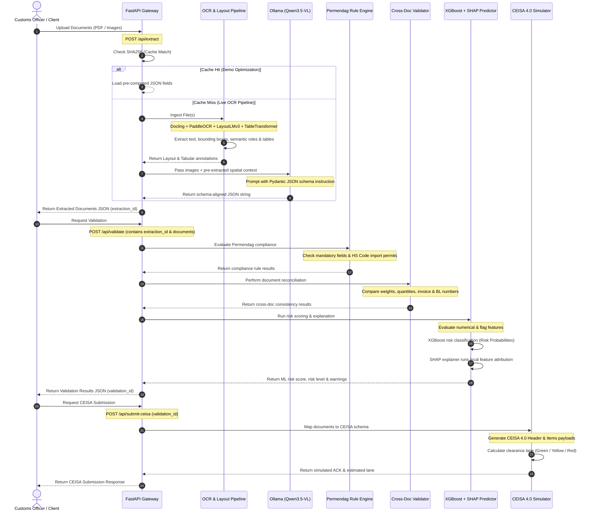

# AI-Powered Customs Declaration Automation Platform: System Flow

This document details the architecture, execution pipeline, and data flow of the platform. The system automates customs compliance checks by ingesting international trade documents, extracting structured fields via neural networks and LLMs, performing cross-document reconciliation, evaluating risk using an explainable Machine Learning model, and compiling simulated CEISA government submissions.

---

## Architectural Process Flow Diagram

The following sequence diagram maps the end-to-end processing pipeline, from document upload to the final CEISA acknowledgement:

---

## Step-by-Step Pipeline Description

### Stage 1: Ingestion & Cache Resolution
1. The user uploads trade documents to `POST /api/extract` (as individual files or a single combined multi-page PDF).
2. The system computes the **SHA256 hash** of the uploaded data.
3. If the hash matches the reference dataset ([UEU-Master-16519-lampiran.Image.Marked.pdf](file:///home/mendoan/Projects/ai-open-2026/dataset/UEU-Master-16519-lampiran.Image.Marked.pdf)), the system instantly resolves the request using the cached high-fidelity JSON data, reducing user-perceived runtime from minutes to sub-second.
4. If a cache miss occurs, the system initiates the live OCR and layout pipeline.

### Stage 2: OCR & Layout Extraction (Live Pipeline fallback)
For a cache miss, the system executes the following steps in sequence:
1. **Docling**: Parses the document structure, extracting text blocks and providing document layout metadata.
2. **PaddleOCR**: Detects text bounding boxes and extracts character coordinates, recording token-level OCR confidence.
3. **LayoutLMv3**: Takes the text and bounding boxes to classify document tokens into spatial-semantic roles (`HEADER`, `FIELD_NAME`, `FIELD_VALUE`, `LINE_ITEM`, `TOTAL`, `OTHER`).
4. **TableTransformer**: Runs structure recognition on the image to locate table borders, rows, and columns, enabling grid-based line-item cell association.

### Stage 3: LLM Structuring (Ollama)
1. The system merges the LayoutLMv3 token roles and TableTransformer row grids into a structured prompt.
2. The prompt is sent along with the document images to **Ollama** running **Qwen3.5** (9B or 27B parameter model).
3. The LLM acts as a structured parser, mapping raw data to the `ExtractedDocuments` schema. It structures fields for `commercial_invoice`, `packing_list`, `bill_of_lading`, and `import_permits` list.

### Stage 4: Rule Engine Evaluation (Permendag Rules)
Once documents are extracted, they are passed to the `PermendagRuleEngine` to check:
1. **Mandatory Fields**: Validates that required fields (like `importer_tax_id` (NPWP), `importer_name`, `currency`, and weights) are present.
2. **Import Permits**: Evaluates the HS Code of line items. For restricted chapters (e.g., Chapter 72 - Iron and Steel, Chapter 61 - Garments, Chapter 87 - Vehicles), it verifies if the corresponding import permit (e.g., `PI_Besi_Baja`, `LS_Tekstil`, `PI_Kendaraan`) is listed in the declaration’s active permits.

### Stage 5: Cross-Document Reconciliation
The `CrossDocumentValidator` runs extensive reconciliation checks across the extracted documents:
1. **Weight Consistency**: Checks that `total_gross_weight` matches between the Packing List and Bill of Lading.
2. **Quantity Consistency**: Matches total item quantities between the Commercial Invoice and the Packing List.
3. **Fuzzy Description Matching**: Compares item descriptions between the Invoice and Packing List using sequence similarity.
4. **PIB Inconsistency Detection**: Reconciles the PIB fields against other documents (detecting number differences like `1V-200114-1` vs `IV-200114-1` in invoice numbers, or `CKCSHA2031403` vs `CKCOSHA2031403` in BL numbers).
5. **Certificate of Origin (Form E) Validation**: Reconciles the Form E reference number and invoice number against the PIB and Commercial Invoice.

### Stage 6: Explainable Machine Learning Classifier (XGBoost + SHAP)
1. The engine compiles rule and consistency flags (e.g., `weight_mismatch_flag`, `missing_permit_flag`, `missing_mandatory_fields_count`, `mean_ocr_confidence`) into a feature vector.
2. The vector is passed to a pre-trained **XGBoost model** which classifies the declaration risk into one of three levels: **Low**, **Medium**, or **High Risk**.
3. The **SHAP (SHapley Additive exPlanations) engine** calculates feature importances for the prediction, explaining *exactly why* the risk score was assigned (e.g., "Weight mismatch across documents contributed to the risk score").

### Stage 7: CEISA 4.0 Simulated Submission Mapping
1. Upon user approval, the validated declaration is sent to `POST /api/submit-ceisa`.
2. The mapping engine translates the documents into a structured CEISA 4.0 Host-to-Host payload format, mapping header variables (importing entity, NPWP, currency, value, weights) and line-item commodities.
3. The system assigns a government clearance status (**estimated clearance lane**):
   * **GREEN Lane**: Low-risk declarations with matching Form E Certificates of Origin (as in our default dataset).
   * **YELLOW Lane**: Medium-risk declarations requiring document recheck.
   * **RED Lane**: High-risk declarations requiring physical inspection (e.g., missing import permits or severe weight mismatches).
4. The system issues a simulated government transaction ACK containing a PIB Number (e.g., `PIB-2020-103989`) and submission timestamp.
